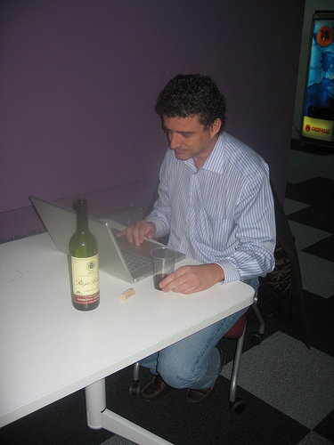

!SLIDE

# Vamos a verlo con ejemplos #

!SLIDE center smaller

### http://mabu.dk/media2/152630/wakecup.jpg ###

!SLIDE

# spork + autospec #

!SLIDE commandLine incremental smaller

    $ gem install ZenTest autotest-rails
    Successfully installed ZenTest-4.2.1
    Successfully installed autotest-rails-4.1.0
    2 gems installed

    $ gem install spork
    Successfully installed spork-0.7.5
    1 gem installed

    cd /path/to/project/root
    spork --bootstrap

    Add --drb to spec/spec.opts

    spork rspec # in one window
 
    autospec # in other window

!SLIDE bullets incremental

## Complementos útiles de RSpec ##

* shoulda
* email-spec
* no-peeping-toms
* parallel-specs
* rspec-on-rails-matchers
* unemcumbered

!SLIDE center smaller

### http://www.flickr.com/photos/jorgegorka/4309871380/ ###

