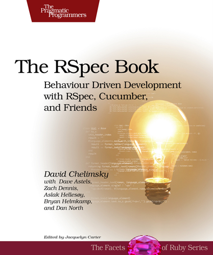

!SLIDE center

# The RSpec Pdf #

!SLIDE

# ¿Por qué RSpec? #

!SLIDE

# ¿Por qué RSpec? #

## Es más fácil de leer ##

!SLIDE code smaller

# ActiveSupport::TestCase vs RSpec v1.3.0#

    @@@ ruby
    class AspgemsTest             # describe Aspgems

    def test("something")         # it "does something descriptive"

    assert_equal 4, array.length  # array.length.should == 4

    def setup                     # before(:each) {}

    def teardown                  # after(:each) {}

!SLIDE code tiny

# Matchers (RSpec v1.3.0) #

## rapidito ##

    @@@ ruby
    @string.should == 'foo' # @string.should equal('foo'), @string.should eql('foo')

    @string.should_not ...

    @array.should_not be_empty # calls @array.empty?

    @string.should_not be_blank # calls @string.blank?

    @hash.should have_key(:foo)

    @string.should match(/\d+/) # @string.should =~ /\d+/

    @object.should be_an_instance_of(String)

    @stack.should have(0).elements

    lambda { @stack.pop }.should raise_error(StackUnderflowError)

    lambda { @stack.push }.should change(@stack.size).by(1)

!SLIDE center bullets incremental

# Rails checklist #

* __Models__
* __Controllers__
* __Helpers__
* __Views__
* E-mails, Rake tasks, JavaScript, ...

!SLIDE commandline incremental small

## Setting the environment ##

    $ gem instal rspec rspec-rails
    Successfully installed rspec-1.3.0
    Successfully installed rspec-rails-1.3.2
    2 gems installed
    $ script/generate rspec
    Configuring rspec and rspec-rails gems in config/environments/test.rb ...

      exists  lib/tasks
      create  lib/tasks/rspec.rake
      create  script/autospec
      create  script/spec
      create  spec
      create  spec/rcov.opts
      create  spec/spec.opts
      create  spec/spec_helper.rb
    $ touch spec/factories.rb
    $ gem install factory_girl
    Successfully installed factory_girl-1.2.3
    1 gem installed

!SLIDE code

## spec/spec_helper.rb ##

    @@@ ruby
    ...
    require 'factory_girl'

    Spec::Runner.configure do |config|
      ...
    end

